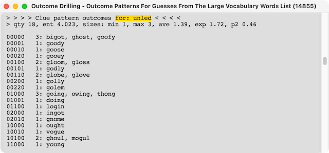
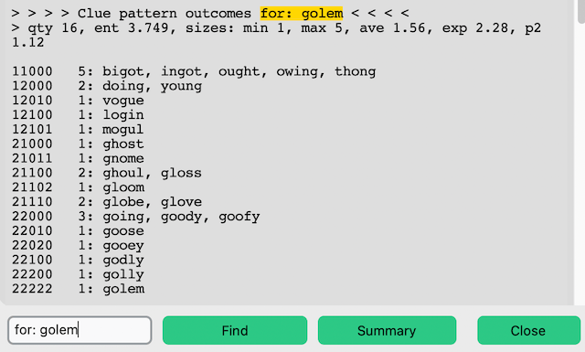

# Expected Number of Steps to Solve E( ) Wordle

## Introduction

Every "guess" one makes in Wordle has an expected number of steps required to solve associated with it. This number, called E( ) herein, shorthand for E(the guess word), is the average number of probable required steps that will arrive at the Wordle solution when each step is played in a consistent specific way. E( ) is based upon probabilities associated with how guess words influence the list of possible solutions for a Wordle game.

Before getting into the weeds it must be noted that a visiting adult son Parker Seidel derived the general formula for E( ) after being requested to lend some brain power to the subject of "groups".

Jargon words and fundamental ideas are used here to avoid cluttering this writing. These are defined at the end in a section named **Definitions and Fundamentals**.

## E( ) General Formula

* E( ) is the sum of the following figure applied to each group generated by the groups analysis:
  * p(Gi)*[1+E(Gi)]
* Note: This formula is in context with "groups". Gi is the i-th group.
* p(Gi) is the probability the solution is in group Gi. p(Gi) is always n/(# of words). The # of words is the number of possible remaining solutions. n is the number of words in group Gi.
* E(Gi) is the expected number of steps for group Gi when the solution is in the group Gi.
* Note the recursion in the formula. The formula refers to the i-th group's E() designated as E(Gi). Each group performs its own p(Gi)*[1+E(Gi)] using its own # of words count for that p(Gi).
* The E() value, number of steps, includes the candidate guess word's step. Understanding this is important when applying the E(Gi) for groups having more than one word member.

## Calculating E( )

* Using the Wordle Helper's **Group Optimal** or **Groups Driller** components one can manually figure the expected number of steps E() of any “guess” because these components identify the groups associated with a guess. These Wordle Helper components operate using all the possible guesses available in whatever guess pool that is selected.
*(to do: explain)

### Example

* In this example the word CARGO is the first play. The match clue is 00011. The word CARGO results in 25 possible solution words.
* Operating Wordle Helper's **Group Optimal** on these 25 possible solution words using only words from these 25 words (Using the **Words Showing** vocabulary source option.), an **in-pool** operation, shows the one word GOLEM as the optimal word. GOLEM divides the 25 words into 16 groups. The maximum group size is 5 words.

  

* Operating Wordle Helper's **Group Optimal** on these 25 possible solution words using all acceptable words (Using the **Large** vocabulary source option.), an operation that allows **out-of-pool** words, shows two words UNLED and GILET as the optimal words. UNLED and GILET divide the 25 words into 18 groups. The maximum group sizes are 3 and 4 words.

  

* Let us calculate the expected number of steps E( ) for each of these three guess words starting with the two 18 group generating words.
  
#### UNLED

* These are the groups UNLED divides the 25 remaining possible solutions according to how UNLED matches to each of the 25 words. Note there is not a 22222 group. UNLED is not one of the 25 words. Therefore there cannot be a 22222 "perfect match" group. UNLED is an **out-of-pool** selection for this step. If one is still unsure about groups, understand that using UNLED for a guess into this 25 remaining possible solutions will result in the word or words for one of these 18 groups being the remaining possible solutions. The actual solution is not known. What is known is that it is one of the 25 words. The prior guesses, just CARGO in this case, established that. The way UNLED "matches", ie its **match clue** after playing UNLED, reveals which group the solution resides.

  

* There is an expected number of steps associated with each group. The following table outlines how the groups for UNLED tally up to arrive at E()=2.2801. (Sorry, the table here is not something generated by **The Wordle Helper**.)
  

* In the above table every **singleton** group, like 11000 or 02000, has E(Gi)=1. Because the group leaves only 1 word to guess, there is 1 more step required in the context of the group. The context already involved the UNLED step. Had UNLED been an **in-pool** selection there would be one **singleton** "perfect match" group 22222 that would have an E(Gi)=0 in this table.
* Every 2 word group has an E(Gi)=1.5. It is assumed an **in-pool** guess will always be made when faced with a choice of 2 words.
* Every 3 word group resulting from UNLED has at least one possible **in-pool** **hole-in-one** guess. Such 3 word groups have an E(Gi)=1.667. All the words in group 00000 are **in-pool** **hole-in-one** guesses. Two of the words in group 01000 are **in-pool** **hole-in-one** guesses. It is assumed one figures out and uses those **in-pool** **hole-in-one** guesses if the leading guess, UNLED in this case, lands into that situation. Submitting the 3 word group to its own group optimal operation as shown using **Groups Driller** in these two images can determine if **in-pool** **hole-in-one** guesses exist.
  
  
  
  
#### GILET

* These are the groups GILET divides the 25 remaining possible solutions according to how GILET matches to each of the 25 words.
  
  
  
* There is an expected number of steps associated with each group. The following table outlines how the groups for GILET tally up to arrive at E()=2.2801. The E( ) closely matches that of UNLET even though GILET has a 4 word maximum group.
  
  
  
* GILET's E( ) is close to UNLET's E( ) because GILET's 4 word group does have two **in-pool** **hole-in-one** guesses. Thus this 4 word group's E(Gi) can be 1.75.

#### GOLEM

* Now lets examine the E( ) for the **in-pool** guess GOLEM.
* These are the groups GOLEM divides the 25 remaining possible solutions according to how GOLEM matches to each of the 25 words.

  

* GOLEM's table is as follows. GOLEM has an E()=2.32 expected number of steps. The E( ) is larger than that for UNLET and GILET as might be expected since there are 16 groups versus 18 groups.
  
  

* GOLEM is an **in-pool** guess. Therefore it has a 22222 "perfect match" group. That group has an E(Gi)=0. Notice that the chance GOLEM is the solution makes a tiny difference to the expected number of steps.
* GOLEM's 5 word group does have **in-pool** **hole-in-one** guesses and thus it has E(Gi)=1.8.

### Note

* A spectacular example was intentionally not chosen. Luck plays a major large role in Wordle.
* In the large scheme fractional differences between guess E( ) are not significant. Compare each of the groups generated by UNLED, GILET and GOLEM. Pretend various words out of that 25 remaining possible solutions list are the solution and see if they fall into a **singleton** group. In this example GHOUL was the solution where CARGO leaves 25 remaining possible solutions. GOLEM and UNLET, not GILET, would have been the better guesses, but they still would not have been **hole-in-one** guesses.

#### Definitions and Fundamentals

* **Match Clue** is the five character code equivalent of Wordle's Grey, Yellow and Green letter color code for guess word to target word letter matching. The character 0 corresponds to Grey. The character 1 corresponds to Yellow. The character 2 corresponds to Green. Each of the five character code positions corresponds to the letter positions in a five letter guess word. **Match Clue** 22222 means all the letters match. **Match Clue** 00000 means no letters match.
  * The guess word CARGO for the solution word GHOUL has 00011 for the match clue.
* **Remaining Possible Solutions** refers to all the possible solutions that satisfy the current known clues. The day's Wordle solution is one of those remaining possible solutions.
* **Groups** refer to unique word groups the remaining possible solutions divides into according to how the words match or mis-matches the letters for a candidate guess word. The candidate guess word matches or mis-matches the words in a group the same, unique way.
  * The Wordle Helper uses 0 to mean a letter in the candidate guess word is not present. This corresponds to Wordle Grey color.
  * The Wordle Helper uses 1 to mean a letter in the candidate guess word is present, but not at this position. This corresponds to Wordle Yellow color.
  * The Wordle Helper uses 2 to mean a letter in the candidate guess word is present and at the correct position. This corresponds to Wordle Green color.
* **Singleton** refers to a group containing only one word.
  * All **singleton** groups, except if it a "perfect match", are E( )=1. In the context of the guess falling into that non-perfect match group the guess step is already made. There will be only one word remaining, the solution, to select. That guess's non-perfect match group's contribution to the expected number of steps is p(Gi)*(1 + 1). Falling into that condition results in 2 steps total.
  * The **singleton** "perfect match" group is E( )=0. In the context of the guess falling into that perfect match group the guess step is already made. That guess's "perfect match" group's contribution to the expected number of steps is p(Gi)*(1 + 0). Falling into that condition results in 1 step total.
* **Hole-In-One (HIO)** refers to a groups result where every group contains only one word. In other words a guess used on a list of N words results in N number groups and thus there is a **largest size 1** reporting.
  * An **out-of-pool** **hole-in-one** guess is an E( )=2. The solution will be in 2 steps, always. The first guess being the **out-of-pool** **hole-in-one** guess. The next guess being the solution.
  * An **in-pool** **hole-in-one** guess is an E( )<2. The E( ) varies according to N starting at 1.667 for N=3.
* **In-Pool** refers to a guess selected from the remaining possible solutions pool. The day's Wordle solution is one of those remaining possible solutions. Which word is the solution is unknown but it's "perfect match" group can have only that word in it. It is a **singleton** group. The **singleton** "perfect match" group's E( )=0. **In-pool** categorization is useful when examining a guess having a **hole-in-one** groups result where every group is **singleton**.  This condition means the group has an E()<2 and by what amount can be significant.
* **Out-Of-Pool** refers to a guess selected that is not a member of the remaining solutions. That guess might have been selected from a pool of words that included the remaining possible solutions but was not one of them. Such a guess cannot have the **singleton** "perfect match". **Out-of-pool** categorization is useful when examining a guess having a **hole-in-one** groups result where every group is **singleton**.  This condition means the group can be resolved to an E()=2 and no further examination is necessary.
* **Groups with two words** always are an E( )=1.5. This is because the choice type into that condition has to be **in-pool** only. If **out-of-pool** choices were allowed then every choice for this condition could result in the same remaining two words. The expected number of steps could be infinite.

#### E( ) Table

| Word Count | Group Qty | E() in-pool HIO | E() out-of-pool HIO | in-pool | out-of-pool |
| :--------: | :-------: | :-------------: | :-----------------: | :-----: | :---------: |
| 2 | 2 | 1.50 |  na  |  na  |  na  |
| 3 | 3 | 1.67 | 2.00 |  na  |  na  |
| 3 | 2 |  na  |  na  | 2.00 | 2.33 |
| 4 | 4 | 1.75 | 2.00 |  na  |  na  |
| 4 | 3 |  na  |  na  | 2.00 | 2.25 |
| 5 | 5 | 1.80 | 2.00 |  na  |  na  |
| 5 | 4 |  na  |  na  | 2.00 | 2.20 |
| 6 | 6 | 1.83 | 2.00 |  na  |  na  |
| 6 | 5 |  na  |  na  | 2.00 | 2.17 |
| 7 | 7 | 1.86 | 2.00 |  na  |  na  |
| 7 | 6 |  na  |  na  | 2.00 | 2.14 |
| 8 | 8 | 1.88 | 2.00 |  na  |  na  |
| 8 | 7 |  na  |  na  | 2.00 | 2.13 |
| 9 | 9 | 1.89 | 2.00 |  na  |  na  |
| 9 | 8 |  na  |  na  | 2.00 | 2.11 |
| 10 | 10 | 1.90 | 2.00 |  na  |  na  |
| 10 |  9 |  na  |  na  | 2.00 | 2.10 |
| 11 | 11 | 1.91 | 2.00 |  na  |  na  |
| 11 | 10 |  na  |  na  | 2.00 | 2.09 |
| 12 | 12 | 1.92 | 2.00 |  na  |  na  |
| 12 | 11 |  na  |  na  | 2.00 | 2.08 |