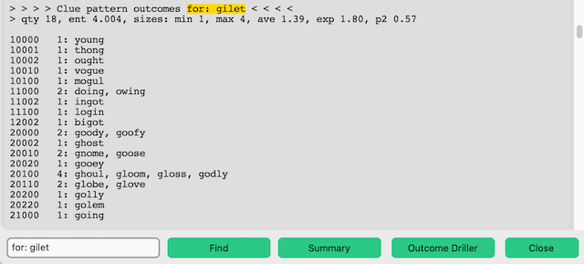

# Expected Number of Steps to Solve E( )

## Introduction

Every "guess" one makes in Wordle has an expected number of steps required to solve associated with it. This number, called E( ) herein, shorthand for E(the guess word), is the average number of probable required steps that will arrive at the Wordle solution when each step is played in a consistent specific way. E( ) is based upon probabilities associated with how guess words influence the list of possible solutions for a Wordle game.

Before getting into the weeds it must be noted that a visiting adult son Parker Seidel derived the general formula for E( ) after being requested to lend some brain power to the subject of "groups".

Jargon words and fundamental are used here to avoid cluttering this writing. These are defined at the end in a section named **Definitions and Fundamentals**.

**E( ) General Formula**

* E( ) is the sum of the following figure applied to each group generated by the groups analysis:
  * p(Gi)*[1+E(Gi)]
* Note: This formula is in context with "groups", a concept not explained here, Gi is the i-th group.
* p(Gi) is the probability the solution is in group Gi. p(Gi) is always n/(# of words). The # of words is the number of possible remaining solutions. n is the number of words in group Gi.
* E(Gi) is the expected number of steps for a group when the solution is in the group Gi.
* Note the recursion in the formula. The formula refers to the i-th group's E(), E(Gi). Each group performs its own p(Gi)*[1+E(Gi)] using its own # of words count for that p(Gi).
* The E() value, number of steps, includes the candidate guess word's step. Understanding this is important when applying the E(Gi) for groups having more than one word member.

**Calculating E( )**

* Using the Wordle Helper's **Group Optimal** or **Groups Driller** components one can manually figure the expected number of steps E() of any “guess” because these components identify the groups associated with a guess. They do this for all possible guesses available in whatever guess pool that is selected.
*(to do: explain)
  
  
  
  
  
  
  
  
**Definitions and Fundamentals**

* **Remaining Possible Solutions** refers to all the possible solutions that satisfy the current known clues. The day's Wordle solution is one of those remaining possible solutions.
* **Groups** refer to unique word groups the remaining possible solutions divides into according to how the words match or mis-matches the letters for a candidate guess word. The candidate guess word matches or mis-matches the words in a group the same, unique way.
  * The Wordle Helper uses 0 to mean a letter in the candidate guess word is not present. This corresponds to Wordle Grey color.
  * The Wordle Helper uses 1 to mean a letter in the candidate guess word is present, but not at this position. This corresponds to Wordle Yellow color.
  * The Wordle Helper uses 2 to mean a letter in the candidate guess word is present and at the correct position. This corresponds to Wordle Green color.
* **Singleton** refers to a group containing only one word.
  * All **singleton** groups, except if it a "perfect match", are E( )=1. In the context of the guess falling into that non-perfect match group the guess step is already made. There will be only one word remaining, the solution, to select. That guess's non-perfect match group's contribution to the expected number of steps is p(Gi)*(1 + 1). Falling into that condition results in 2 steps total.
  * The **singleton** "perfect match" group is E( )=0. In the context of the guess falling into that perfect match group the guess step is already made. That guess's "perfect match" group's contribution to the expected number of steps is p(Gi)*(1 + 0). Falling into that condition results in 1 step total.
* **Hole-In-One** refers to a groups result where every group contains only one word. In other words a guess used on a list of N words results in N number groups and thus there is a **largest size 1** reporting.
  * An **out-of-pool** **hole-in-one** guess is an E( )=2. The solution will be in 2 steps, always. The first guess being the **out-of-pool** **hole-in-one** guess. The next guess being the solution.
  * An **in-pool** **hole-in-one** guess is an E( )<2. The E( ) varies according to N starting at 1.667 for N=3.
* **In-Pool** refers to a guess selected from the remaining possible solutions pool. The day's Wordle solution is one of those remaining possible solutions. Which word is the solution is unknown but it's "perfect match" group can have only that word in it. It is a **singleton** group. The **singleton** "perfect match" group's E( )=0. **In-pool** categorization is useful when examining a guess having a **hole-in-one** groups result where every group is **singleton**.  This condition means the group has an E()<2 and by what amount can be significant.
* **Out-Of-Pool** refers to a guess selected that is not a member of the remaining solutions. That guess might have been selected from a pool of words that included the remaining possible solutions but was not one of them. Such a guess cannot have the **singleton** "perfect match". **Out-of-pool** categorization is useful when examining a guess having a **hole-in-one** groups result where every group is **singleton**.  This condition means the group can be resolved to an E()=2 and no further examination is necessary.
* **Groups with two words** always are an E( )=1.5. This is because the choice type into that condition has to be **in-pool** only. If **out-of-pool** choices were allowed then every choice for this condition could result in the same remaining two words. The expected number of steps could be infinite.
  