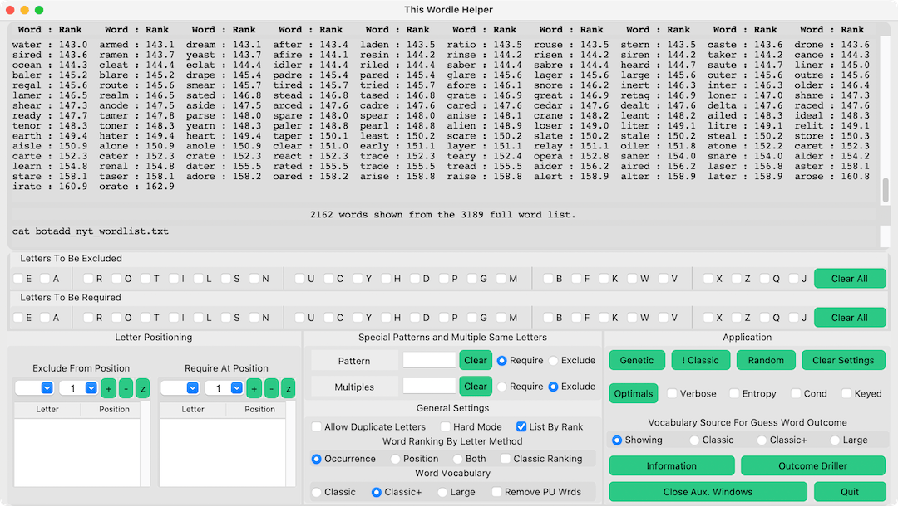
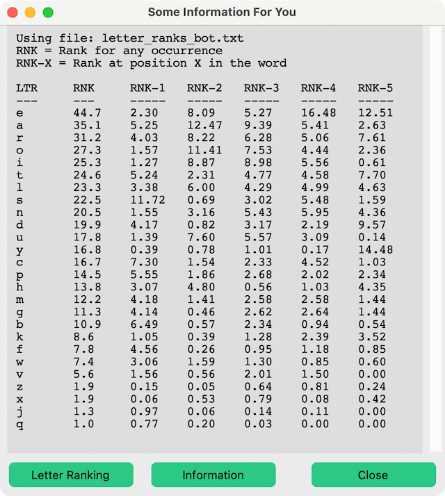

# pywt.py

## A python based Wordle game helper

* **Main Window:**

* **In Use Main Window Shown Next to NYT Results:**

* **Information Window:**
  The information window explains the Helper features in detail and so that is not explained in this Readme. The previous two images are intended to show what the Helper does.


### What To Expect From This Helper

* Expect nothing more than a helper with a thorough vocabulary that presents words only matching the letters you specify.
* The Helper was created for investigating Wordle word pick strategies. Using the Helper removes the task of thinking up five-letter words to allow one to focus only on play strategy.
* The Helper "knows" the words but not which word is the solution. As such the Helper ruins the game for those where thinking up words is the attraction to Wordle.  

### Running the Wordle helper

* Open a **Terminal** window
* Change to the folder where you placed **pywy.py** and the other files and folders.
* Enter the command: ```python3 pywt.py```
* For Apple OSX and Linux systems double-clicking the **start-pywt.command** file in the **Finder** also starts the Wordle helper.

### Running the Wordle helper with **start-pywt.command**

* **start-pywt.command** is a shell script intended for launching the Wordle helper from a computer's file browser. It should run the helper with a double-click after being properly setup.
* Setting up **start-pywt.command** requires marking it an executable file. This is later described in **Installing the Wordle helper**
* **start-pywt.command** checks for required components before launching the Wordle helper. It reports what components are missing and will not launch the Wordle helper when critical components are missing.
* **start-pywt.command** output looks like this when it is launching the Wordle helper:


### Requirements

* python3: (<https://www.python.org/downloads/>)
* pip: (<https://pypi.org/project/pip/>)
* customtkinter

'tkinter' provides graphical user interface support for python applications. It comes with python. 'customtkinter' is an expansion to 'tkinter'. This Wordle game helper uses some customtkinter features and so it needs to be installed along with python3. 'pip' is python's utility for installing components like 'customtkinter'. 'pip' needs to be installed in order to install customtkinter.

After installing python3 and pip, the following commands entered in a Terminal window will install 'customtkinter':
`pip3 install --upgrade customtkinter==4.5.6`

* Note: normally we would install customtkinter using `pip3 install customtkinter`, but starting with version 4.5.7 through at least 4.5.10, there is a fatal problem.

### Installing the Wordle helper

* Download the **pywtpackage.zip** release file from the repository releases link.
* Unzip the **pywtpackage.zip** release file. It should unzip to be a folder named pywtpackage.
* Rename the **pywtpackage** folder as you wish and place the folder with its contents to where you would like to keep it.
* A file privilege for the **start-pywt.command** double-click-to-run convenience file needs to be changed for it to work. Use the command: ```chmod +x start-pywt.command``` executed in Terminal, at the file's folder, to make the change.
* In the zip package, this **README.md** file, the images it uses and a couple of files in the **worddata** folder regarding letter ranking may be deleted if desired. The only required files, and their associated folder, that are in **pywtpackage.zip** are:
  * **start-pywt.command**  (the double-click-to-run convenience file)
  * **pywt.py**             (the app.)
  * **helpers.py**          (a helper to the app.)
  * **helpinfo.txt**        (help information)
  * **letter_ranks.txt**    (letter ranking)
  * **nyt_wordlist.txt**    (wordlist - shuffled)
  * **wo_nyt_wordlist.txt** (wordlist - shuffled)

### Word Ranking

* **Letter Ranking Information Window:**


* The five-letter words are assigned a rank according to how common the letters are in the English Wordle words list. Three different ranking methods are possible. Each method sums a rank associated with each letter in the word. The above image, which can be shown by pressing **Letter Ranking** in the **Information** window, shows the ranks associated with each letter. This data is read from the **letter_ranks.txt** text file found in the **worddata** directory.
* The **Occurrence** method does not consider where letters occur in the word. The **RNK** column is the letter associated rank value. This value is how many times greater the letter is found ***once*** in a word compared to the least frequently occurring letter in the Wordle words list. **Occurrence** does not consider letter position.
* The **Position** method considers the letter's position. The **RNK-X** column is the letter associated rank value for the letter being in the X word's letter position. This value is the fraction of the letter's **RNK** that occurs when the letter is at the X position.
* The **Both** method sums the **Occurrence** and the **Position** methods. The method first biases the word rank according to by letter occurrence ranking. Then it up promotes the rank according to letter position rank.
* These ranking method are essentially of different scales. Each should not be compared to each other for any particular word.
* Word rank represents relative occurrence probability; however, any word matching the filter could be the Wordle word regardless of its rank.

### Genetic Ranking

* Genetic Rank is a measure of how related via its letters a word is to other words amongst a word group. Each word in a group is assigned a 1x26 vector of 0 or 1 entries that flags whether a letter occurs in that word. Those vectors from the word group are summed to result in a 1x26 vector that is counting the letter flags in the word group. A word's genetic rank is calculated as the sum product of a word's flag vector and the word group's summing flag vector. The word's rank is then increased by each time a letter in that word occurs more than once. 
* Using the highest genetic ranking word minimizes the worst possible Wordel outcome. In a simple example consider a word group of three words. The worst possible outcome is three guesses. If there is one or two highest genetic ranking words in this group, then picking one of those words first reduces the worst possible outcome to two guesses.

### Wordle Play Strategies

* Discover Wordle play strategies yourself with the Helper's assistance. That was the reason for creating this Helper.
* One initial goal was to find a strategy that tends to result in an under-three-pick Wordle game. This Helper appears to show that is impossible.
