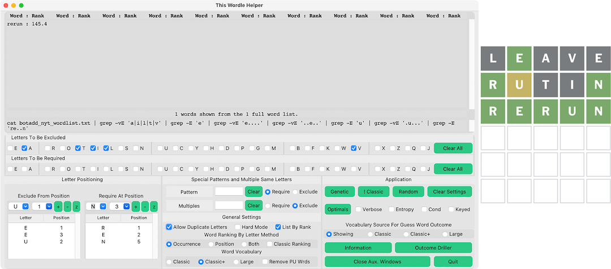
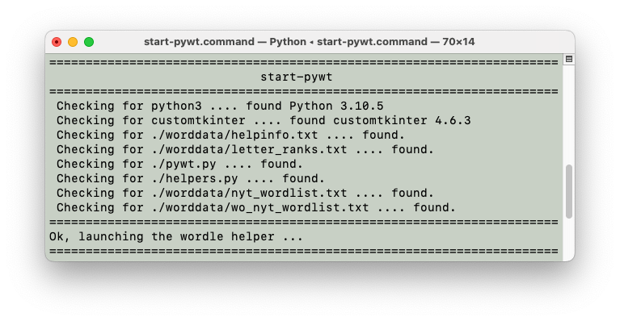
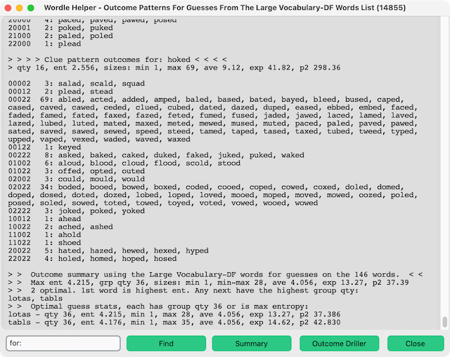
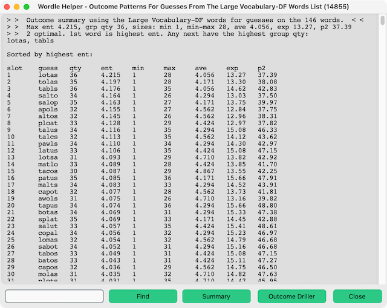
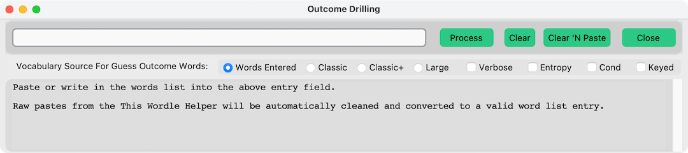
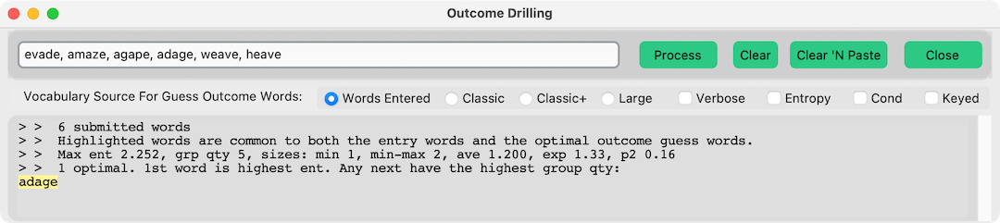
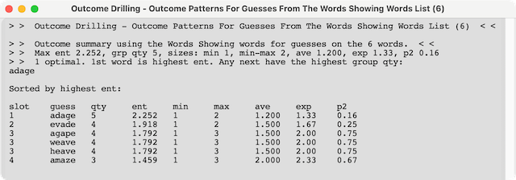
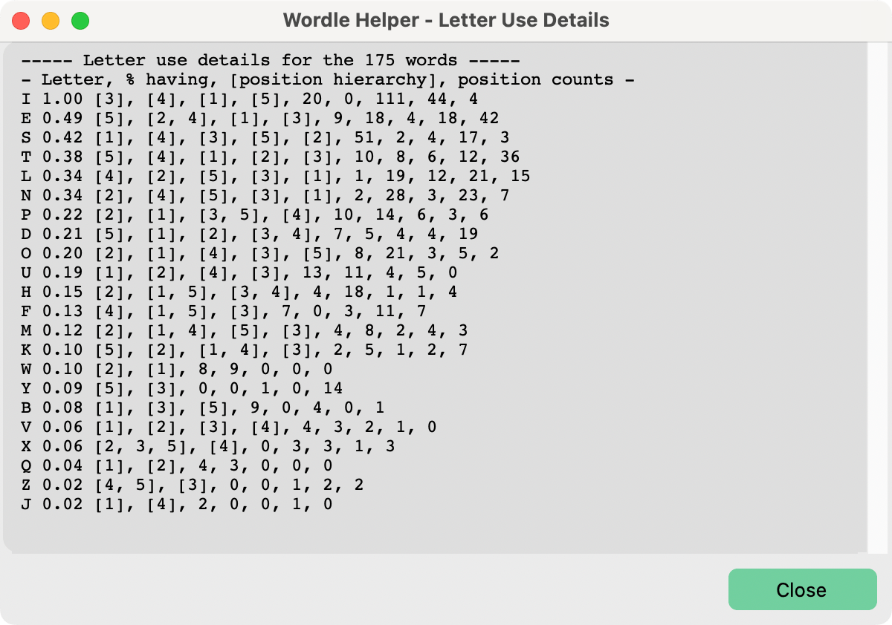

# pywt.py

## A python based Wordle game helper

* **Main Window:**

* **In Use Main Window Shown Next to NYT Results:**

* **Information Window:**
  The information window explains the **Helper** features in detail. Its content is included at this Readme's end section. The previous two images are intended to show what the **Helper** does.


### What To Expect From This Helper

* Expect nothing more than a helper with a thorough vocabulary that presents words only matching the letters you specify.
* The **Helper** was created for investigating Wordle word pick strategies. Using the **Helper** removes the task of thinking up five-letter words to allow one to focus only on play strategy.
* The **Helper** "knows" the words but not which word is the solution. As such the Helper ruins the game for those where thinking up words is the attraction to Wordle.
* The **Helper** can calculate the outcome set **entropy** or **information bits** for every guess applied to the current words showing. The guess having the highest outcome set  **entropy** is the best guess baring any additional information regarding the words showing and also baring secondary inter-outcome word interactions.
* A companion to the **Helper** is the outcome set analyzer **Outcome Driller**. The **Helper's** **Outcome Driller** button runs an instance of the **Outcome Driller's** output in context with the words the **Helper** currently shows. The **Outcome Driller** button runs a separate **Outcome Driller** word outcome analyzer instance. Its purpose is for examining outcome properties in a manor independent of the **Helper**  and without disturbing the **Helper's** current state. Outcomes can be used to calculate the expected number of steps associated with any guess word. See [EXPECTEDSTEPS_Readme.md](EXPECTEDSTEPS_Readme.md) for more information.
* A side show to the **Helper** is **fmwm.py**. This is the Finite Monkey Wordle Machine (**FMWM**). **FMWM** dispatches a machine, the monkey, to perform Wordle related tasks, like how many random guesses are required to solve Wordles. It can also find all the **Magic Words** present in the vocabulary for a given word. **Magic Words** reduce the selection guess pool to contain just the solution word. See [FMWM_Readme.md](FMWM_Readme.md) for more information.

### Running the Wordle helper

* Open a **Terminal** window
* Change to the folder where you placed **pywy.py** and the other files and folders.
* Enter the command: ```python3 pywt.py```
* For Apple OSX and Linux systems double-clicking the **start-pywt.command** file in the **Finder** also starts the Wordle helper.

### Running the Wordle Helper with **start-pywt.command**

* **start-pywt.command** is a shell script intended for launching the Wordle helper from a computer's file browser. It should run the helper with a double click after being properly setup.
* Setting up **start-pywt.command** requires marking it an executable file. This is later described in **Installing the Wordle Helper**
* **start-pywt.command** checks for required components before launching the Wordle helper. It reports what components are missing and will not launch the Wordle helper when critical components are missing.
* **start-pywt.command** output looks like this when it is launching the Wordle helper:


* This window shows up when the **Wordle Helper** successfully launches.


### Word Ranking

* Word ranking based on letter occurrence frequency is part of what this Wordle **Helper** was initially developed to investigate and then automate as a selection strategy for the **FMWM**. This is why the word lists are shown ranked in this way and why these instructions appear to emphasize **Word Ranking** even though the **Helper** has evolved to perform the more effective **Outcome** analysis method.

* **Letter Ranking Information Window:**


* Five-letter words are assigned a rank according to how common the letters are in the Wordle possible solution words list. Three different ranking methods are possible. Each method sums a rank associated with each letter in the word. The above image, which can be shown by pressing **Letter Ranking** in the **Information** window, shows the ranks associated with each letter. This data is read from the **letter_ranks.txt** or the **letter_ranks_bot.txt** text files found in the **worddata** directory. The **letter_ranks.txt** ranking file is based upon the **Classic**, original NYT Wordle solutions words list (The 2,309 word list.). The **letter_ranks_bot.txt** ranking file is based upon the **Classic+** words list. The **Classic+** words list is what the NYT Wordlebot uses for its possible solutions word list. The **Helper** defaults to using the **Classic+** words list.
* The **Occurrence** method considers letters occurring at least once in the word. The **RNK** column is the letter associated rank value. This value is how many times greater the letter is found ***once*** in a word compared to the least frequently occurring letter in the Wordle words list. **Occurrence** does not consider letter position nor does it value multiple letter occurrence above single occurrence.
* The **Position** method considers the letter's position. The **RNK-X** column is the letter associated rank value for the letter being in the X word's letter position. This value is the fraction of the letter's **RNK** that occurs when the letter is at the X position.
* The **Both** method sums the **Occurrence** and the **Position** methods. The method first biases the word rank according to by letter occurrence ranking. Then it up promotes the rank according to letter position rank.
* These ranking method are of different scales. Do not compare their ranking for any particular word. Instead, compare the ranking between different words.
* Word rank represents relative occurrence probability; however, any word matching the filter could be the Wordle word regardless of its rank.

### Optimals

* **Optimals** identifies words from the words in the current words **Showing**, or in one of the vocabulary sources: **Classic**, **Classic+** or **Large**, likely to result in the least number of remaining solutions when used as a guess against the current **Words Showing** solutions word list.
* Any word from the **Words Showing** list used as a guess has a chance of being the solution. That chance is related to the number of **Words Showing**. When the number of **Words Showing** is three or more words the best guess becomes more likely a word that is not the solution. The solution being one of three words might be solved in two steps by first guessing a word not of the three that eliminates two words no matter which of the three words is the solution.
* For any guess the **Words Showing** change relates to the unique ways that guess word is wrong for each of the **Words Showing**. Some guess words leave fewer remaining words to choose from. It is possible for a word to leave only a one word remaining for every which way that word was wrong. You would solve the Wordle in your next guess under that condition. Optimal guess words might be in the **Words Showing** but are more likely selected from the other vocabulary sources. **Optimals** identifies those words.
* Outcome word sets are words that share a unique clue pattern. Thus, an outcome is an abstract that is both the clue pattern and the outcome of words. A separate window opens to report all the outcome pattern information when the **Verbose** checkbox is checked.
* Assuming the various settings have not excluded the solution from the current words showing and considering the solution is a random list member, then dividing the list into many small choice outcomes will on average minimize the number of guess required to narrow down to the solution.
* Outcome identified with **Optimals** or **Outcome Driller**, in verbose mode, can be used to calculate the expected number of steps associated with any guess word. See [EXPECTEDSTEPS_Readme.md](EXPECTEDSTEPS_Readme.md) for more information. Calculating the expected number of steps can augment understanding Wordle dynamics, but it is not necessary for selecting words.
* The play word having the most **Entropy** is often the best Wordle play. **Entropy** calculated by this **Wordle Helper** assigns equal probability to every word in the possible solutions list. The NYT WordleBot does not treat all possible solutions as equal for its **entropy** word scores. Entropy comparisons should be made within the same context. For example, compare the **Wordle Helper** entropy difference between two words to the NYT WordleBot entropy difference between the same two words. **Wordle Helper** reports **Entropy** as **ent** in its report tables. 
* The actual best Wordle play is the word having the least expected number of steps to solve. **Wordle Helper** does not calculate the least expected number of steps to solve. It does produce the data necessary for that calculation but experience will show that **Entropy** is a very, very close substitute. **Entropy** reveals the words that result in the most evenly distributed outcome sizes by looking at outcome sizes. Expected number of steps to solve calculation looks at outcome sizes **and** word interactions between words within outcomes. Word interactions within an outcome can have the effect of decreasing the actual outcome size. For example, a four word outcome can take only two plays to solve. The **Entropy** calculation would not know that. The expected number of steps to solve calculation would know that.
* The **min-max** value is the minimum size of the maximum outcome sizes in guess words identified to yield the largest number of word outcomes. Many guess words can yield the same largest number of word outcomes. But the word outcome sizes can vary. One wants to know the smallest maximum outcome size in the outcomes analysis summary. The **min-max** value also coordinates with the summarized **p2** value.
* The **ave** is the average number of words in the word outcomes.
* The **exp** value is the guess' expected size for the resulting word outcome. Expected size is the sum of the probability weighted word outcome sizes. 
* The **p2** value is the outcomes size population variance. This value is useful. It is a measure of how variable the outcome sizes are resulting from a guess candidate. When candidates have the same number of outcomes, select the candidate that has the smallest **p2**. Doing so removes the chance the solution will be a member of the larger outcomes because the outcome sizes vary less in size. When candidates vary in **p2** you will see they have differing maximum outcome sizes.
* Larger **Entropy** values typically, but not always, go with the largest outcome qty having the smallest **min-max** value and smallest **p2** value. The NYT WordleBot selects by its expected number of steps to solution calculation, which is closely coupled to the **Entropy** value.
* Optimal outcome analysis should always be performed on the total selection list that contains multiple letters.



* The **Verbose Report** **Find** button scrolls the report window to the last found search text instance, which will be highlighted. Include **'for: '** in the search text when searching for a guess word's pattern. Include **'qty: '**' when searching for guesses having the same outcome quantities. To avoid finding to many text instances the search text must have five or more characters, beware however; it is possible to hopelessly bog down the search when trying to highlight commonly found text. Verbose reports using the **Large** vocabulary can be 400,000 text lines. Verbose report text can be copy-pasted into text editors.


* The **Keyed** option when enabled without the **Cond** option, adds the guess word to each verbose data line. This preserves the guess word to which the data belongs. The report can then be analyzed by some other application.
  


* The **Cond** checkbox results in the verbose output to be a **condensed** format that lists the guess words in order of highest information entropy first. Here is an example:



* The **Keyed** option when enabled with the **Cond** option, adds the entropy rank slot number to each condensed data line. The slot number is indexed according to the entropy rank slot into which guess resides. Guesses can have equal rank order with other guess words. Thus a guess might appear as 4th down in the ranking but in fact might be sharing the 1st rank slot with the guesses listed above it. The **Keyed** option makes this obvious, but it does interfere with using advanced regex filters in Find because the guess word is no longer the first line on which the regex operates.

* Pressing the Left Meta key while pressing the **Optimals** button causes the number of clue types associated with each guess to be reported.

* The concept of **Wordle Outcome** is explained in an allegory here: [Groups Allegory](/groupsallegory/README.md). Note that "Groups" is the more confusing term for "Outcomes".
  
### Outcome Driller



* **Outcome Driller** is a side utility that performs an outcome analysis using the **Words Entered**. **Classic**, **Classic+** and **Large** vocabulary against any outcome of **Words Entered** into its input field. It is intended for investigating a guess word's outcome effective size, in other words how easily a word's outcome word set resolves to a single word.
* The **Entropy** option filters the summarized optimal words to those that contain the highest gained entropy information.
* Copy a word outcome from any **Verbose Report** (or a spreadsheet row) and paste it into the **Outcome Driller** entry field. Text that includes rank numbers copied from the Helper words list may also be pasted. Pasted text will be properly formatted into a list and analyzed when pressing the **Process** button. Pressing and releasing the **Return** keyboard key will instead clean and format the entry without starting the analysis process.
* The word entry field appears limited in the number of words it can take, but you can actually paste the entire **Large** vocabulary, rankings included, into the entry. The rankings will be automatically stripped away.
* **Clear 'N Paste** clears the current list entries and pastes the current **Clipboard** to be the entry. The entry is then cleaned up. Whatever words you have copied last get pasted. The **Clipboard** will then be empty. **Clear 'N Paste** will not clear the current entry if the **Clipboard** happens to be empty.
* With **Outcome Driller** running, one leaves the Helper's **Verbose Report** open using its **Find** feature to show a guess's outcomes. Copy and Paste an outcome to be further analyzed into the **Outcome Driller** entry field. Then press the **Process** button.
* **Outcome Driller** can, given the time, process essentially an unlimited number of words in context with **The Wordle Helper**. The entire **Large** vocabulary may be copied and pasted from **The Wordle Helper**.
* **Outcome Driller** summarizes the results and also opens a **Verbose Report** identical to the type shown by the Helper. The workflow allows one to leave the Helper's verbose outcomes window open to navigate to different guess word results that can be then investigated further by pastes into the **Group Driller**.



* The **Group Driller** verbose report window is not being shown in this **README**. It is identical in function and appearance to the **Helper's** verbose report window when not using the **Condensed** option.
* The **Keyed** option includes the guess word for each outcome pattern. This option is useful for maintaining the guess word associations when exporting the outcome data (copy and paste) for all guesses.
* The **Condensed** option verbose report omits showing the guess word outcomes. Instead, only the guess word's outcome stats are output in a format intended for copy and pasting into a spreadsheet application for further investigation.
* The **Condensed** listing shows Wordle **Standard (Default) Mode** or **Hard Mode** guesses as ranked by **Entropy**. The **General Settings** **Hard Mode** option controls which type of guess **Condensed** mode reports.
* The **Find** feature operates on regex patterns. For example, if the letter **i** is required as the 2nd letter and the letter **r** is required as the last letter, then "**^.i..r**" is the regex pattern that will cause all words like **timer**, **sitar** and **tiger** to be highlighted. Note that the "**^**" is required. Its regex meaning is "starting with". The "**.**", or dots, mean "any character." 



### Letter Use View



* Pressing the **Genetic** button while also holding down the left or right meta keys, which are the keyboard keys next to the space bar key, performs the **Genetic** operation and displays letter use information for the currently showing words. The same happens when pressing the **Process** button in the **Outcome Driller** while holding down a meta-key.
* The letter use information is particularly useful for choosing the next guess word because the most commonly used letters amongst the remaining solutions list that are not yet identified will better disperse the remaining solutions than the least commonly found letters.
* The letter use information is:
  * Letter
  * % (fraction) of words in the list that have the letter
  * Letter position counts in order from position 1 to position 5
  * Letter position hierarchy in order of position most to position least
  * Example: **W, 0.06, 2, 0, 1, 0, 2, [1, 5], [3]** means the letter W is in 6% of the words. The first five numbers not [ ] bracketed are the counts for W at each position. Two words have W at the 1st position. No words have W at the 2nd position. One word has a W at the 3rd position. No words have W at the 4th position. Two words have a W at the 5th position. The numbers in brackets, [ ], indicate the most common positions. Positions 1 and 5, ie [1, 5], share the most common W occurrence position. Position 3 is the next common position.
  
### Wordle Play Strategies

* Discover Wordle play strategies yourself with the Helper's assistance. That was the reason for creating this Helper.
* One initial goal was to find a strategy that tends to result in an under-three-pick Wordle game. This Helper appears to show that is impossible.

### Information Window Content

The Wordle helper shows five-letter words from which you can select for playing the Wordle game.

#### Word Ranking Method

* The five-letter words are assigned a rank according to how common the letters are in the Wordle possible solution words. The 'Occurrence' method does not consider where letters occur in the word. The 'Position' method considers the letter's position. The 'Both' method adds the other two rank values. This helper presents the ranked words from the lowest rank to the highest rank. The word list always shows scrolled to the highest ranking words at its bottom. Scroll the list upwards to see the lower ranking words.

* Checking the **Classic Ranking** option ranks according to the Classic 2309 Wordle solutions letter frequency. When **Classic Ranking** is not checked ranks are assigned according to the Classic+ solutions letter frequency.

* Word rank represents relative occurrence probability; however, any word matching the filter could be the Wordle word regardless of its rank.

#### Word Filtering

* The **Allow Duplicate Letters** option includes words having duplicate letters. After your first or second Wordle choice you should start to consider words with duplicate letters. Depending on your known letters status, duplicate letters ought to be shown before making the third selection.

* Checking **Letters To Be Excluded** letter check boxes results in words not containing those letters.

* Checking **Letters To Be Required** letter check boxes results in words containing those letters. No words will show when six or more letters are required for the word.

* The checkboxed **Exclude** and **Required** letters are arranged in order of use frequency based on the **Classic Ranking**. The checkboxed letters do not rearrange to **Classis+ Ranking** when that ranking is in use. **Classis+ Ranking** is the default ranking. The actual ranking order currently in use is seen when freshly selecting the **Letter Ranking** button in the **Information** window.

* The **Clear All** button in the checkbox lineups clears all the checkboxes in that lineup. The letter check boxes are ordered according to letter use frequency. The vertical lines indicate a jump in letter use frequency and are useful to describe letter rank outcome types. The outcome descriptions in turn provide a language useful for discussing game strategy and game results.

* **Letter Positioning** is where letters may be excluded or required for one of the five possible Wordle word letter positions. For each requirement, select the letter and position. The plus (**+**) and minus (**-**) buttons add or remove the respective position requirement. The **Z** buttons clear the entire position list.

* In the puzzle game context a letter indicated not at its correct position is a letter known to be present in the word, so it will also be required. For such letters, its checkbox will not appear checked in **Letters To Be Required**, but its filter requirement will be applied. If perhaps you want to follow a strict letter elimination strategy, and you want the helper word list to not include unknown position letters, then use the letter's **Letters To Be Excluded** check box and do not apply an **Exclude From Position** for that letter. Otherwise, the word list will be empty because no word can have the letter and also not have the letter.

* **Special Patterns and Multiple Same Letters** are two features: Special Patterns and Multiple Same Letters.

Special **Pattern** allows one to quickly introduce a custom require or exclude filter pattern that can operate on letter position. **Pattern** was initially intended for adjacent letter patterns such as TT, ITE, GHT or SS. One might use this to compare the number of words having a SS pattern versus S.S or S..S patterns where the period character, ".", means 'any letter'. The pattern S..S shows words having any two letters between S letters like the words SMUSH and TSARS.

**Pattern** turns out to be especially useful for spotting words outcomes in part because its setting is independent of the Exclude and Require Position controls. Thus, you can very quickly set and then clear **Pattern** without affecting one's thought train.

**Multiples** allows one to specify "there must be two E letters" or "there cannot be two E letters, nor three E letters". The entry format is 'number''letter' , 'number''letter' and so on. For example: 2A,3E. A space character also puts in the comma for you.

**Multiples** is a concept that may be difficult to understand. If your guess word has multiple same letters and one of those letters is yellow or green then all words with two or more of those letters must be *excluded* via **Multiples** because one of those letters being gray means the solution has just one of those letters.

You can ignore the **Multiples** idea when all of those same letter guess letters are grey.

If your guess word has multiple same letters and both of those letters is yellow or green in any combination then all words with two or more of those letters must be *included* via **Multiples**. An easy mistake is not to position exclude subsequent additional yellow letter clues for letters for which you already have **Multiples** indicated.

You might need to think about needing three of those letters being *included*. **Multiples** operates as either include or exclude. More complicated requirements can be achieved by combining **Multiples** inclusions with **Exclude From Position** exclusions or **Special Pattern**. The Helper does not do any thinking for you in this regard.

* **Hard Mode** restricts the guesses shown by the **Optimals** feature to comply with Wordle Hard Mode rules where green letters must be used in their green positions and yellow letters must be somewhere present.

* **Special Pattern** allows one to quickly introduce a custom require or exclude filter pattern that can operate on letter position. One might use this to compare the number of words having a **SS** pattern versus **S.S** or **S..S** patterns where the period character, "**.**", means 'any letter'. The pattern **S..S** shows words having any two letters between S letters like the words SMUSH and TSARS.

* **Special Pattern** turns out to be especially useful for spotting word outcomes in part because its setting is independent of the Exclude and Require Position controls. Thus, you can very quickly set and then clear **Special Pattern** without affecting one's thought train.

* **Hard Mode** controls the guess word type that is used by **Optimals**. The **Hard Mode** option uses the **Exclude From Position** and the **Include At Position** data. These designations must be entered for **Hard Mode** to properly filter guess word candidates. In **Hard Mode** green letters must be used in their green positions and yellow letters must be present. Yellow letters can occupy wrong positions. Grey letters can be used without any restriction. **The Wordle Helper** will not correctly require the rare cases where multiple yellow same letters are required.

* **Genetic** highlights the highest **genetic ranking** word in the current showing word list. The highest **genetic ranking** word is a word from the list that is most in common with the word list in regard to letters. The highest **genetic ranking** word, or words sometimes, could either rule out the most number of words or rule in the highest number of discovered letters. For example for the word GLIDE, its genetic rank is the sum of all the times its own letters, G, L, I, D, E show up once in each word in the given list plus an adjustment equal to the number of times a letter in the subject word (GLIDE) repeats within the subject word. High **genetic ranking** words perform well as Wordle plays. It is quickly determined and is often what some people like to figure from the words they think remain. That is why the method is a pywordletool feature. **Genetic ranking** is a valid strategy, but it does not perform as quite as well as **outcomes analysis**.

* **!Classic** highlights all the words showing that were not part of the **Classic** or NYT original Wordle solutions list. Many of these "Not Classic" possible solutions are often considered unlikely to be a solution.

* **Random** highlights a random word in the current showing word list. There can be a point where there is no single better selection amongst the remaining words list. Any one of the words shown could be the Wordle word or might have equal results as any other word in the list. This feature is intended for use when the list has become small where you can surmise the correct word would be a random selection.

* **Optimals** highlights the word or words that result in the lowest average remaining words when that word is used as a guess. The analysis is performed on the current words **Showing** or the entire **Classic**, **Classic+** or **Large** vocabularies using **outcomes analysis**. The process identifies the guess word that makes an **outcomes** set having the highest **entropy**. The outcome finding process is lengthy and may take an extended time to finish. The outcome optimal guess word is likely to result in smaller remaining word outcomes, thus increasing chances to find the solution in fewer guesses. Optimal outcome analysis should be performed on the total selection list that contains multiple letters because the analysis is for selecting the solution versus guessing for letter discovery. A separate window opens to report all the outcome pattern information during the analysis when the **Verbose** checkbox is checked. Group optimal words identified from guess word sources other than the showing words cannot be highlighted if the word is not in the shown list.

* **Verbose** output displays either all the outcome data resulting from guesses or a sorted condensed outcomes data list. The **Cond.** checkbox sets which mode is displayed. In the standard verbose display the verbose summary lists those words that generate the most number of outcomes and also the guess word having the highest entropy. That highest entropy word might generate less word outcomes. This display is sorted by entropy. Because the list only shows the highest entropy word it omits less outcome generating guesses that have higher entropy than those maximum outcome generating guesses. In short, the standard verbose summary shows the top guess, but does not necessarily show the top x guesses. The condensed verbose display lists the guesses sorted by entropy. That display shows the top x entropy guesses.

* **Entropy** filters the optimal guess words to those that contain the highest gained entropy information bits (base 2). Many guess words can result in the same number of possible solution word outcomes, but the number of words in those outcomes can vary. There can be a technical information difference due to the word outcome sizes. The information is quantified as entropy.

* **Cond.** The verbose output will be a **condensed** format that lists the guess words in order of highest information entropy first. Besides showing the best entropy based guess choice, the condensed verbose output is particularly useful to copy and paste into another application to more quickly find the hard mode compliant guesses.

* The **Keyed** checkbox indexes the verbose data output lines. 
* In the standard verbose mode, ie not the condensed mode, the data is keyed according to what guess word to which the data applies. This format can be useful for copying and pasting the data to another application for further processing while maintaining to which guess word the data applies.
* In the verbose condensed mode, each guess is indexed according to which entropy rank slot it resides. Guesses can have equal rank.

#### Word Vocabulary

* The **Large** vocabulary is the 14,855 word list. Wordle accepts only words that are in the **Large** vocabulary. A fraction of the **Large** vocabulary words are words that will be the day's Wordle solution. Originally, forNew York Times (NYT) Wordle, that faction was 2,309 words. The **Classic** vocabulary is those 2,309 words. The balance of the **Large** vocabulary with the **Classic** vocabulary removed are words that would never be solution words. The NYT acquired Wordle and in coordination with its **WordleBot** implementation is making changes to the vocabularies. One change transfers words from **Large** vocabulary to add to the **Classic** vocabulary. Furthermore, the NYT has removed some words considered politically incorrect. Supposedly, not all NYT transferred words may not be are actual solution candidates. The **Classic** plus the transferred words and less the censored words is the **Classic+** vocabulary.

* Using the **Classic+** vocabulary yields results essentially identical to what the NYT **WordleBot** shows. The transferred words are not published, but they can be inferred from **WordleBot** remaining words outputs.

* Another change the NYT has made is to censure some **Classic** words. Thus, some **Classic** words that were originally solution candidates have been removed from the possible solutions list. These words are still acceptable play words but will never be a solution and will never show up in a **WordleBot** remaining solutions list. These words will show up in **The Wordle Helper**. When using the **Classic+** word vocabulary for possible solution candidates, (Make sure **Allow Duplicate Letters** is checked.), the remaining words should equal what the **WordleBot** indicates.

* The **Remove PU Words** option removes the previously used (PU) solutions from the solutions list. Doing so will result in at least a one guess advantage. The PU words list changes every day. This list will always be incomplete unless you update it daily. The PU words list is the file "pu_wordlist.txt" in the worddata folder.

* If **The Wordle Helper** shows more words than **WordleBot** by a word or so, then there is a censured word or there is an issue with multiple same letters.
* If **The Wordle Helper** shows fewer words than **WordleBot**, then **The Wordle Helper** is missing some transferred words or there is an issue with multiple same letters.

#### Tips

* When adding a new exclusion position for a letter that already has an excluded position, first select that letter's exclusion in the list. That selection puts the letter in the combobox so that you need only to indicate the letter position before pressing the plus (**+**) button.

* Seeing an empty list can seem to be an error at times. No, it is not an error. The criteria you entered resulted in the empty list. A simple example is **Excluding** a letter and then also **Requiring** that same letter. The filtering happens in discrete stages. In the simple example, the resulting list of words that exclude a letter is then asked to list words having that same letter. There would be none.

* **Exclude From Position** in the **Letter Positioning** options applies letter requirements for letters you indicate for position exclusion. This is actually two separate filter commands. The letter is **required** in the word, but not at the position indicated. **Wordle** uses **Yellow** color blocks for such letters. In subsequent guesses, **Wordle** marks that same previously marked **Yellow** color letter as **Grey** color when that letter is not in the correct position ***and when the guess has erroneous multiple instances of that same letter***. **Exclude From Position** such letters. Do not apply the broad brush **Excluding** for such letters. An empty list results if you do as just previously explained.
  
* Beware in general of any guess that contains multiple same letters. You are in the clear when all of those letters are gray. Otherwise, you have to stop and think. If only one is either a green or yellow clue then then you should take all possible measures to exclude extraneous words. If both letters are a clue, particularly two yellow clues or a green and yellow clue, then filtering for the multiple same letter is required. The **Special Patterns and Multiple Same Letters** control will help you with these situations.

* A use method that mitigates the multiple same letter pitfall is to enter the letter clues only for the 1st word guess. Then use the **Outcome Driller** feature for all subsequent words where you would be copy and pasting outcomes from **Verbose** reports into the **Outcome Driller** for starting the process to select the next word guess. The outcomes you copy and paste would inherently be correct outcomes instead of an incorrect outcome shown in the **This Wordle Helper** that might result from not correctly entering clue information. Such an error would still be possible for that 1st word guess clue information.

### Word Vocabularies

* The **Classic** and **Large** word vocabularies are current as of May 3, 2023. In the past year the vocabularies were seen to change once.
* The **Classic+** word vocabulary is the **Classic** word vocabulary plus additional words that the NYT **WordleBot** adds to the **Classic** words for reasons not explicitly explained by the NYT but that clearly serve both as an intentional fuzziness to the vocabulary the **WordleBot** uses to solve the **Wordle** and to serve as a means to add additional solutions that the **WordleBot** would be able to solve. The **outcome (groups)** method used by the **WordleBot** and this **Wordle Helper** requires the solution to be within the possible solutions' vocabulary.

## Requirements and Installation

### Requirements
* Linux, Apple OSX or Microsoft Windows running a Linux subsystem
  * It should be possible to have the **Helper** running in a Linux subsystem running in Microsoft Windows, but these instructions do not explain how. The Linux subsystem would need to have OS components, like 'cat', 'grep' and 'bash' typically present on any Apple OSX or Linux system in addition to the python3, pip and customtkinter installs.  
* **python3**: (<https://www.python.org/downloads/>)
  * As of this writing Python 3.10 is recommended.
    * **Customtkinter** can have a problem with Python 3.12.
    * There is an annoying graphical user interface focus bug when using Python 3.12 where the controls on the **Helper** window do not activate unless the window background is first touched. Using Python 3.10 avoids the problem. Using the command ```python3.10 pywt.py``` runs the **Helper** in Python 3.10 when other Python3 versions are present on your system.
  * Python 3.12 can be used.
    * 'distutils', a deprecated module used by **Custimtkinter**, was removed from Python 3.12. Nevertheless, it will be installed using the command "pip3 install setuptools" entered in a Terminal window.
* **pip**: **pip** is a package installer for **python3**.
* **customtkinter**

'tkinter' provides graphical user interface support for python applications. It should automatically install with python, but be aware you might need to manually install it. 'customtkinter' is an expansion to 'tkinter'. This Wordle game helper uses some **customtkinter** features and so it needs to be installed along with **python3**. 'pip' is python's utility for installing components like 'customtkinter'. 'pip' needs to be installed in order to install customtkinter.

#### Installing **python3**, **pip** and **customtkinter**

* First, install **python3** by using the standard install package provided at <https://www.python.org/downloads/>. Be aware **Python3** can be installed by using many different methods. Each method may install **python3** and its versions at different locations on your system. This can cause complications for you if you are not aware of it. Each of the next two requirements **pip** and **customtkinter** will be installed at the specific **python3** version and location that corresponds to the **python3** version used to install them. For this reason using the standard install package provided at <https://www.python.org/downloads/> is recommended.
* Second, install **pip** by using the command `python3 -m ensurepip --upgrade` entered in a Terminal window. Not all **python3** installations are equal. It is possible for the **ensurepip** feature to not exist, in which case you will need to search the web for the method that works for your situation to install **pip**.  
* Lastly, install **customtkinter** by using the command `pip3 install --upgrade customtkinter==4.6.3` entered in a Terminal window.

* Note: **customtkinter** is in active development. Changes to it might cause Wordle **Helper** to fail running. When using the convenience script **start-pywt.command** to start the Wordle **Helper** there is no failure feedback other than not seeing the **Helper**. As of this writing the **Helper** runs with **customtkinter** versions 4.6.3 and 5.2.2.  Version 4.6.3 and 5.2.2 with this **Helper** in Apple OSs: Ventura 13.0, Monterey 12.6 and Catalina 10.15.7.

### Installing the Wordle Helper

* Download the **pywtpackage.zip** release file from the repository releases link.
* Unzip the **pywtpackage.zip** release file. It should unzip to be a folder named pywtpackage.
* Rename the **pywtpackage** folder as you wish and place the folder with its contents to where you would like to keep it.
* A file privilege for the **start-pywt.command** double-click-to-run convenience file needs to be changed for it to work. Use the command: ```chmod +x start-pywt.command``` executed in Terminal, at the file's folder, to make the change. The same applies to the other convenience file: **start-fmwm.command**. For these use the commands: ```chmod +x start-fmwm.command``` executed in Terminal, at the file's folder, to make the changes.
* In the zip package, this **README.md** file, the images it uses and a couple of files in the **worddata** folder regarding letter ranking may be deleted if desired. The only required files, and their associated folder, that are in **pywtpackage.zip** are:
  * **start-pywt.command**  (the double-click-to-run convenience script file)
  * **pywt.py**             (the wordle helper app.)
  * **helpers.py**          (a helper to the app.)
  * **groupdrilling.py**    (a helper app for outcome analysis)
  * **fmwm.py**             (a command line application to measure strategies)
  * **start-fmwm.command**  (convenience script file to run fmwm.py)
  * **helpinfo.txt**        (help information)
  * **letter_ranks.txt**    (letter ranking data file)
  * **nyt_wordlist.txt**    (wordlist - shuffled)
  * **wo_nyt_wordlist.txt** (wordlist - shuffled)
  * **pu_wordlist.txt**     (previously used wordlist. You need to maintain this list if you intend to take advantage of previously used solutions.)
